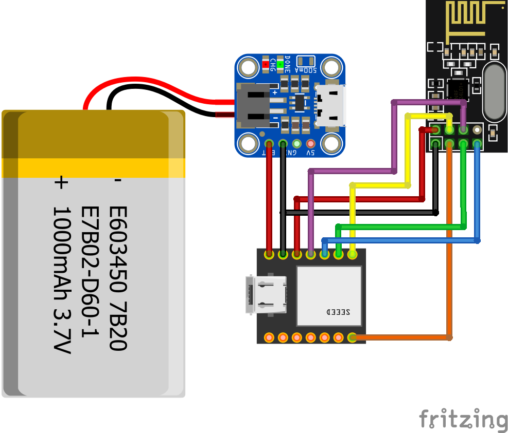

# CMEN-Lite
Cosplay Modular Effects Network starter kit

## About

This repo provides information on how to build a super simple framework for wireless communication between costume parts in a cosplay. Or, you know, pretty much anything, but the context here is cosplay.

By adding CMEN to your costume, you can control lights in your helmet from a switch in your hand, without needing to run wires up the side of your face. But that's just one example. The inputs and outputs are limited only by your imagination (and numerous other restrictions, such as number of pins on the microcontroller, the amount of code you can smush into its flash memory, and the fact that we live in a physics-driven universe).

Input examples include buttons, light sensors, accelerometers, microphones, potentiometers, flex sensors, humidity sensors, etc.

Output examples include change LED colours, playing loud and tinny sound effects, opening your helmet's visor, expanding your wings, blasting vape clouds into non-smokers' faces, and many more.

## Get Started

Before you do much else, you'll need some parts. The below list gives you the basics, but it's not set in stone. You may prefer to use a different MCU, or a smaller battery, or something. I can vouch for these parts working together, though.

You can get the code up and running with a couple of Arduino Unos and the transceiver modules, for example.

### Shopping List

I am in no way affiliated with Pimoroni, it's just where I happened to buy these from. Aside from them being UK based, you may find better deals elsewhere, so feel free to shop around 🙂

- [NRF24L01 Wireless Transceiver Modules (2 pack)](https://shop.pimoroni.com/products/2-4-ghz-nrf24l01-wireless-tranceiver-module-2-pcs)
- [Seeeduino Xiao](https://shop.pimoroni.com/products/seeeduino-xiao)
- [Adafruit Microlipo Charger](https://shop.pimoroni.com/products/adafruit-micro-lipo-charger-for-lipoly-batt-with-usb-type-c-jack)
- [1200mAh LiPo Battery](https://shop.pimoroni.com/products/lipo-battery-pack?variant=20429082183)

### 

### Circuit Diagram (you'll need 2 of these)

